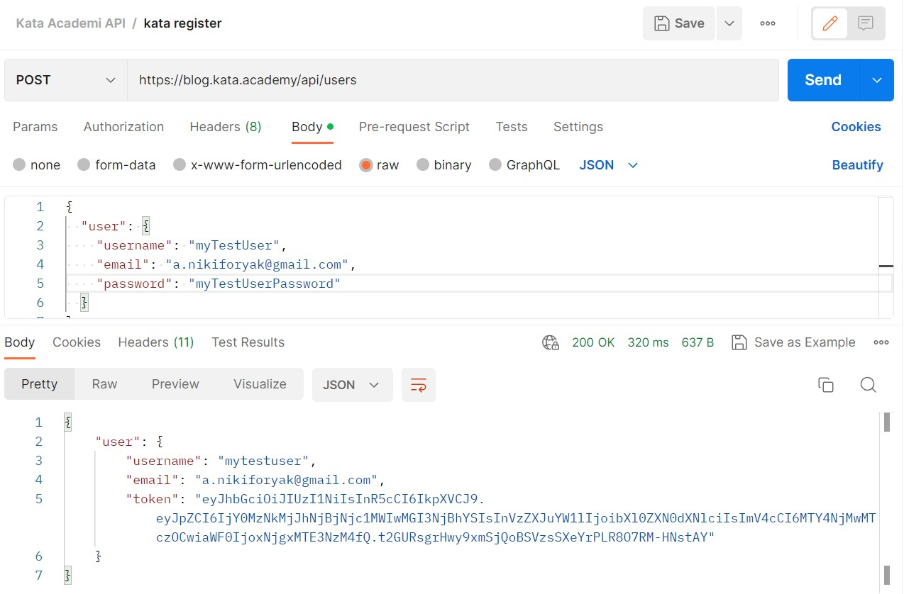
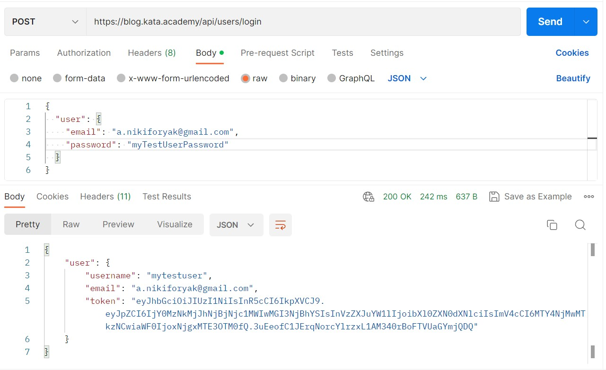
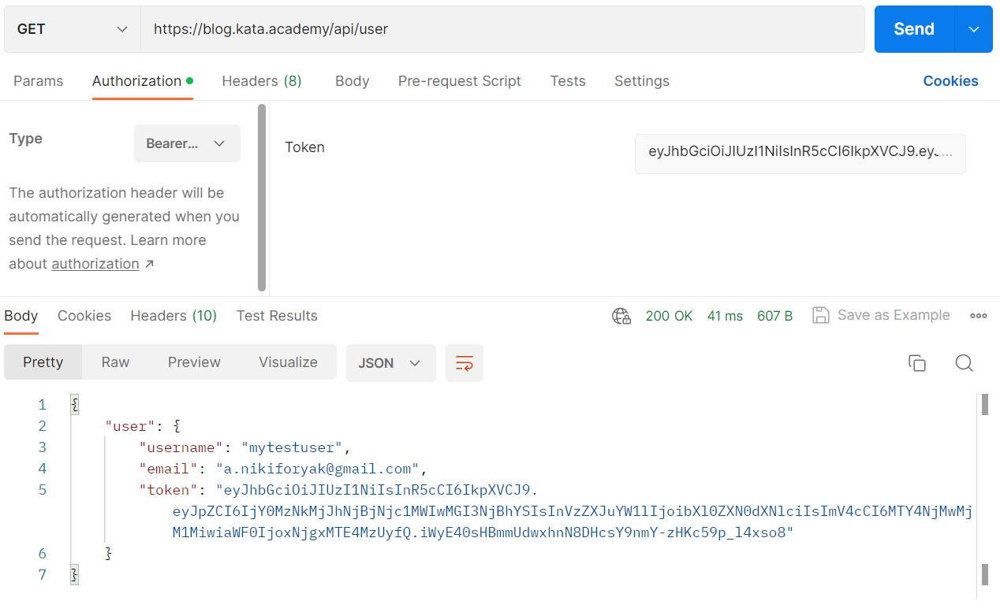

# Задание

Вам нужно изучить документацию к API, провести регистрацию, аутентификацию (логин) и получить данные пользователя, отсылая http запросы.

Корневое API (без указания endpoint выдает json с ошибкой): https://kata.academy:8021/api

Документация по апи: https://api.realworld.io/api-docs/

1. Качаем Postman, дальше все запросы отправляем с его помощью
2. Смотрим документацию
3. Регистрируемся (Registration)
4. Логинимся (Authentication)
5. Используя заголовок авторизации получить  данные текущего пользователя (Endpoints -> Get Current User)

# Выполнение

Использовалось API https://blog.kata.academy/api

1. Регистрация

2. Аутентификация

3. Получение данных текущего пользователя

